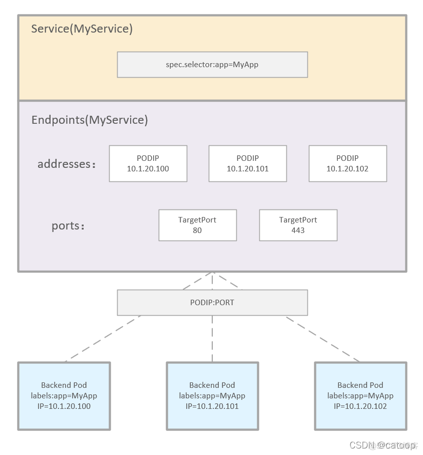
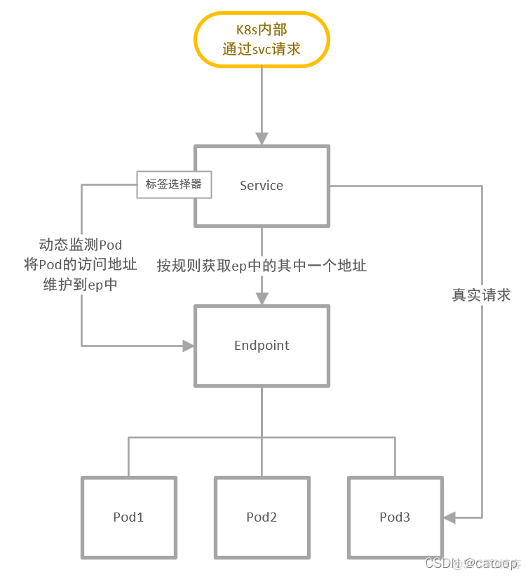

# 24小时后添加新的计算节点

kubeadm 生成的token TTL 默认为24小时， 可以通过参数设置

--ttl duration             The duration before the token is automatically deleted (e.g. 1s, 2m, 3h). If set to '0', the token will never expire (default 24h0m0s)

在24小时候如果需要继续添加节点，可以参考以下命令添加 

```
# 查看token
[root@master1 job]# kubeadm token list
TOKEN                     TTL         EXPIRES                USAGES                   DESCRIPTION                                                EXTRA GROUPS
8tyy3l.w6ugh45mvdv4dyru   10h         2022-06-16T13:36:38Z   authentication,signing   <none>                                                     system:bootstrappers:kubeadm:default-node-token
rx9enc.js5hsjhbh2vxj0p5   11h         2022-06-16T14:27:08Z   authentication,signing   <none>                                                     system:bootstrappers:kubeadm:default-node-token

# 在master节点行执行

# 生成新的token
token=`kubeadm token create`

# 生成新的hash 
hash=`openssl x509 -pubkey -in /etc/kubernetes/pki/ca.crt | openssl rsa -pubin -outform der 2>/dev/null | openssl dgst -sha256 -hex | sed 's/^.* //'`

# 最终生成新的join命令
echo "kubeadm join 192.168.26.141:6443 --token $token --discovery-token-ca-cert-hash sha256:$hash"

# 在新的计算节点上执行 kubeadm join 命令

```

 

# service, endpoints

Service: 将运行在一组 Pod上的应用程序公开为网络服务的抽象方法。

使用 Kubernetes，你无需修改应用程序即可使用不熟悉的服务发现机制。 Kubernetes 为 Pods 提供自己的 IP 地址，并为一组 Pod 提供相同的 DNS 名， 并且可以在它们之间进行负载均衡。

---

Kubernetes 中的 Service，它定义了一组Pods的逻辑集合和一个用于访问它们的策略。一个 Service 的目标 Pod 集合通常是由Label Selector 来决定的。

Endpoints 是一组实际服务的端点集合。一个 Endpoint 是一个可被访问的服务端点，即一个状态为 running 的 pod 的可访问端点。一般 Pod 都不是一个独立存在，所以一组 Pod 的端点合在一起称为 EndPoints。只有被 Service Selector 匹配选中并且状态为 Running 的才会被加入到和 Service 同名的 Endpoints 中。

只有配置了 selector 的 service 才会自动创建一个同名的 endpoints，没有配置 selector 的 service 不会产生 endpoints 资源对象

Pod 是 Kubernetes中能够创建和部署的最小单元，是 Kubernetes 集群中的一个应用实例







demo：

```
# 创建 deploy 
[root@master1 init]# kubectl create deployment demo --image quay.io/junkai/demo:1.0

# 查看service， 此时没有deploy demo 所对应的service
[root@master1 init]# kubectl get svc
NAME         TYPE        CLUSTER-IP     EXTERNAL-IP   PORT(S)    AGE
kubernetes   ClusterIP   10.96.0.1      <none>        443/TCP    10d
prestop      ClusterIP   10.105.70.43   <none>        8080/TCP   3h37m

# 创建service 
[root@master1 init]# kubectl expose deploy/demo --port=8080
service/demo exposed

# 查看service 
[root@master1 init]# kubectl get svc
NAME         TYPE        CLUSTER-IP       EXTERNAL-IP   PORT(S)    AGE
demo         ClusterIP   10.102.239.104   <none>        8080/TCP   2s
kubernetes   ClusterIP   10.96.0.1        <none>        443/TCP    10d
prestop      ClusterIP   10.105.70.43     <none>        8080/TCP   3h38m

# 查看endpoints， 可以看到此时endpoint 就是对应的pod （IP+port）
[root@master1 init]# kubectl get endpoints/demo
NAME   ENDPOINTS             AGE
demo   10.244.104.153:8080   9s
[root@master1 init]#

# 扩容 deploy， 再次查看，可以看到endpoints 增加， 同时 service 保持不变 
[root@master1 init]# kubectl scale --replicas=2 deploy/demo
deployment.apps/demo scaled
[root@master1 init]# kubectl get svc
NAME         TYPE        CLUSTER-IP       EXTERNAL-IP   PORT(S)    AGE
demo         ClusterIP   10.102.239.104   <none>        8080/TCP   25s
kubernetes   ClusterIP   10.96.0.1        <none>        443/TCP    10d
prestop      ClusterIP   10.105.70.43     <none>        8080/TCP   3h38m
[root@master1 init]# kubectl get ep/demo
NAME   ENDPOINTS                                 AGE
demo   10.244.104.153:8080,10.244.210.204:8080   31s
```


# POD

## POD 生命周期

Pod 在其生命周期中只会被调度一次。 一旦 Pod 被调度（分派）到某个节点，Pod 会一直在该节点运行，直到 Pod 停止或者 被终止

如果一个节点死掉了，调度到该节点 的 Pod 也被计划在给定超时期限结束后删除

任何给定的 Pod （由 UID 定义）从不会被“重新调度（rescheduled）”到不同的节点； 相反，这一 Pod 可以被一个新的、几乎完全相同的 Pod 替换掉。 如果需要，新 Pod 的名字可以不变，但是其 UID 会不同

###  POD 阶段

Pod 的 `status` 字段是一个 [PodStatus](https://kubernetes.io/docs/reference/generated/kubernetes-api/v1.24/#podstatus-v1-core) 对象，其中包含一个 `phase` 字段。

Pod 的阶段（Phase）是 Pod 在其生命周期中所处位置的简单宏观概述。 该阶段并不是对容器或 Pod 状态的综合汇总，也不是为了成为完整的状态机。

Pod 阶段的数量和含义是严格定义的。 除了本文档中列举的内容外，不应该再假定 Pod 有其他的 `phase` 值。

如果某节点死掉或者与集群中其他节点失联，Kubernetes 会实施一种策略，将失去的节点上运行的所有 Pod 的 `phase` 设置为 `Failed`

下面是 `phase` 可能的值

| 取值                | 描述                                                         |
| :------------------ | :----------------------------------------------------------- |
| `Pending`（悬决）   | Pod 已被 Kubernetes 系统接受，但有一个或者多个容器尚未创建亦未运行。此阶段包括等待 Pod 被调度的时间和通过网络下载镜像的时间。通常集群的资源不满足需求也会出现Pending |
| `Running`（运行中） | Pod 已经绑定到了某个节点，Pod 中所有的容器都已被创建。至少有一个容器仍在运行，或者正处于启动或重启状态。 |
| `Succeeded`（成功） | Pod 中的所有容器都已成功终止，并且不会再重启。               |
| `Failed`（失败）    | Pod 中的所有容器都已终止，并且至少有一个容器是因为失败终止。也就是说，容器以非 0 状态退出或者被系统终止。 |
| `Unknown`（未知）   | 因为某些原因无法取得 Pod 的状态。这种情况通常是因为与 Pod 所在主机通信失败。 |

相关命令: 可以通过 `kubectl describe pod xxx` 来查看pod的阶段

### 容器状态

Kubernetes 会跟踪 Pod 中每个容器的状态，就像它跟踪 Pod 总体上的[阶段](https://kubernetes.io/zh-cn/docs/concepts/workloads/pods/pod-lifecycle/#pod-phase)一样。 你可以使用[容器生命周期回调](https://kubernetes.io/zh/docs/concepts/containers/container-lifecycle-hooks/) 来在容器生命周期中的特定时间点触发事件。

一旦[调度器](https://kubernetes.io/zh/docs/reference/command-line-tools-reference/kube-scheduler/)将 Pod 分派给某个节点，`kubelet` 就通过 [容器运行时](https://kubernetes.io/zh/docs/setup/production-environment/container-runtimes) 开始为 Pod 创建容器。 容器的状态有三种：`Waiting`（等待）、`Running`（运行中）和 `Terminated`（已终止）。

要检查 Pod 中容器的状态，你可以使用 `kubectl describe pod <pod 名称>`。 其输出中包含 Pod 中每个容器的状态。

每种状态都有特定的含义

**waiting**: 如果容器并不处在 `Running` 或 `Terminated` 状态之一，它就处在 `Waiting` 状态。 处于 `Waiting` 状态的容器仍在运行它完成启动所需要的操作：例如，从某个容器镜像 仓库拉取容器镜像，或者向容器应用 [Secret](https://kubernetes.io/zh/docs/concepts/configuration/secret/) 数据等等。 当你使用 `kubectl` 来查询包含 `Waiting` 状态的容器的 Pod 时，你也会看到一个 Reason 字段，其中给出了容器处于等待状态的原因。

**Running**：`Running` 状态表明容器正在执行状态并且没有问题发生。 如果配置了 `postStart` 回调，那么该回调已经执行且已完成。 如果你使用 `kubectl` 来查询包含 `Running` 状态的容器的 Pod 时，你也会看到 关于容器进入 `Running` 状态的信息

**Terminating**:  处于 `Terminated` 状态的容器已经开始执行并且或者正常结束或者因为某些原因失败。 如果你使用 `kubectl` 来查询包含 `Terminated` 状态的容器的 Pod 时，你会看到 容器进入此状态的原因、退出代码以及容器执行期间的起止时间。

如果容器配置了 `preStop` 回调，则该回调会在容器进入 `Terminated` 状态之前执行。


## postStart 和 preStop 处理函数

当一个容器启动后，Kubernetes 将立即发送 postStart 事件；在容器被终结之前， Kubernetes 将发送一个 preStop 事件。容器可以为每个事件指定一个处理程序 

如果 Pod 中的容器之一定义了 `preStop` [回调](https://kubernetes.io/zh/docs/concepts/containers/container-lifecycle-hooks)， `kubelet` 开始在容器内运行该回调逻辑。如果超出体面终止限期时，`preStop` 回调逻辑 仍在运行，`kubelet` 会请求给予该 Pod 的宽限期一次性增加 2 秒钟

preStop 最长等待时间为 30s，


通常情况下，容器运行时会发送一个 TERM 信号到每个容器中的主进程。 很多容器运行时都能够注意到容器镜像中 `STOPSIGNAL` 的值，并发送该信号而不是 TERM

```
apiVersion: apps/v1
kind: Deployment
metadata:
  creationTimestamp: null
  labels:
    app: prestop
  name: prestop
spec:
  replicas: 1
  selector:
    matchLabels:
      app: prestop
  strategy: {}
  template:
    metadata:
      creationTimestamp: null
      labels:
        app: prestop
    spec:
      containers:
      - image: quay.io/junkai/demo:1.0
        name: demo
        resources: {}
        lifecycle:
          postStart:
            exec:
              command: ["/bin/sh", "-c", "echo Hello from the postStart handler > /usr/share/message"]
          preStop:
            exec:
              command: ["sleep", "20"]
status: {}

```

demo

```
# 部署试验 deployment  
kubectl apply -f prestop.yaml
kubectl expose deploy/prestop --port=8080
kubectl scale --replicas=2 deploy/prestop


# 查看poststart 执行情况
[root@master1 pod]# kubectl exec -it prestop-5cc9f67f46-f8jrd sh
kubectl exec [POD] [COMMAND] is DEPRECATED and will be removed in a future version. Use kubectl exec [POD] -- [COMMAND] instead.
/ # cat /usr/share/message
Hello from the postStart handler
/ #

# 查看preStop执行情况
1. 打开两个窗口，分别 logs 每个pod 的日志
2. kubectl get svc 获取 svc 为10.105.70.43 
3. 再打开一个窗口 执行， curl 10.105.70.43:8080 
4. 可以看到访问被平均的分布到两个pod上 
5. 执行 kubectl delete pod xxxx 删除其中一个pod
6. 观察结果，此时可以看到 被删除的pod处于 Terminating 状态，此时 多次执行 curl 10.105.70.43:8080, 可以看到旧的pod上边没有新的流量，同时另外一个pod上每隔两次curl 会产生一条记录，说明其中一半的请求被分到了新生成的pod上 
7. 结果说明： 执行 kubectl delete pod xxx 之后，pod 会收到 STOPSIGNAL 信号，此时preStop 会被调用，同时service中的iptable规则会重写，导致旧的pod不会收到流量， 这个场景适用于优雅终止

```


## 静态 Pod 

通过在一个指定的、受 `kubelet` 监视的目录下编写文件来创建 Pod 。 这类 Pod 被称为[静态 Pod](https://kubernetes.io/zh-cn/docs/tasks/configure-pod-container/static-pod/)。 静态 Pod 不受 `kubectl` 和其它 Kubernetes API 客户端管理。 静态 Pod 不依赖于 API 服务器，这使得它们在启动引导新集群的情况下非常有用


```
#  worker1 
cd /etc/kubernetes/manifests

cat <<EOF >static-web.yaml
apiVersion: v1
kind: Pod
metadata:
  name: static-web
  labels:
    role: myrole
spec:
  containers:
    - name: web
      image: nginx
      ports:
        - name: web
          containerPort: 80
          protocol: TCP
EOF
```

demo：

```
# 通过kubectl命令可以看到static pod 被创建出来
[root@master1 manifests]# kubectl get pod -o wide
NAME                                   READY   STATUS      RESTARTS         AGE    IP               NODE                        NOMINATED NODE   READINESS GATES
... 
static-web-worker1.myk8s.example.com   1/1     Running     0                21s    10.244.104.134   worker1.myk8s.example.com   <none>           <none>

# 可以尝试通过kubectl 删除 static pod， 然后会发现，pod 又重新创建出来了，说明这个pod受 kubectl 管理
[root@master1 manifests]# kubectl get pod
NAME                                   READY   STATUS      RESTARTS       AGE
... 
static-web-worker1.myk8s.example.com   1/1     Running     0              3s

# 如何 删除 static pod 

登陆到static pod 所在节点

cd /etc/kubernetes/manifests
rm -rf static-web.yaml 

```


## 同一个POD中多个container


pod是k8s调度的**最小单元**。

1个pod可以包含**1个或多个容器**，可以理解为pod是容器集合。

pod相当于**逻辑主机**，每个pod通过describe可以看到都有自己的ip地址。

pod内的容器可以**共享相同的ip和端口空间**。

进入pod后，正常的**linux命令**可以使用，若pod内包含多个容器，进入到每个容器都相当于进入了一个逻辑主机


### 共享存储

```
apiVersion: v1
kind: Pod
metadata:
  name: two-containers
spec:
  restartPolicy: Never
  volumes:
  - name: shared-data
    emptyDir: {}

  containers:

  - name: nginx-container
    image: nginx
    volumeMounts:
    - name: shared-data
      mountPath: /usr/share/nginx/html

  - name: debian-container
    image: debian
    volumeMounts:
    - name: shared-data
      mountPath: /pod-data
    command: ["/bin/sh"]
    args: ["-c", "echo Hello from the debian container > /pod-data/index.html"]

```


demo

```
# 查看pod ip
[root@master1 pod]# kubectl get pod -o wide
NAME                     READY   STATUS      RESTARTS       AGE    IP               NODE                        NOMINATED NODE   READINESS GATES
...
two-containers           1/2     NotReady    0              58m    10.244.30.94     worker3.myk8s.example.com   <none>           <none>


[root@master1 pod]# curl 10.244.30.94
Hello from the debian container

```


### 共享命名空间

当启用进程命名空间共享时，容器中的进程对该 pod 中的所有其他容器都是可见的，可以使用此功能来配置协作容器，比如日志处理 sidecar 容器，或者对那些不包含诸如 shell 等调试实用工具的镜像进行故障排查

```
apiVersion: v1
kind: Pod
metadata:
  name: nginx
spec:
  shareProcessNamespace: true     # 需要添加这一行
  containers:
  - name: nginx
    image: nginx
  - name: shell
    image: busybox:1.28
    securityContext:
      capabilities:
        add:
        - SYS_PTRACE
    stdin: true
    tty: true
```


demo

```
# 执行以下命令，可以看到pod 中有两个container, 分别是nginx 和 container
kubectl describe pod nginx

# 执行以下命令，进入到nginx container中，在其中执行ps 命令，发现无法执行，说明nginx container 中没有相关命令
[root@master1 pod]# kubectl exec -it nginx -c nginx  sh
kubectl exec [POD] [COMMAND] is DEPRECATED and will be removed in a future version. Use kubectl exec [POD] -- [COMMAND] instead.
# ps
sh: 1: ps: not found


# 执行以下命令，进入到shell container 中，这里有ps 命令，说明两者之间的不同
[root@master1 pod]# kubectl exec -it nginx -c shell  sh
kubectl exec [POD] [COMMAND] is DEPRECATED and will be removed in a future version. Use kubectl exec [POD] -- [COMMAND] instead.
/ # ps -ef
PID   USER     TIME  COMMAND
    1 65535     0:00 /pause
    7 root      0:00 nginx: master process nginx -g daemon off;
   37 101       0:00 nginx: worker process
   38 101       0:00 nginx: worker process
   39 root      0:00 sh
   45 root      0:00 sh
   51 root      0:00 ps -ef

# 执行 kill 命令，可以看到， nginx 重置了，生成新的pid 
/ # kill -HUP 7
/ # ps -ef
PID   USER     TIME  COMMAND
    1 65535     0:00 /pause
    7 root      0:00 nginx: master process nginx -g daemon off;
   39 root      0:00 sh
   45 root      0:00 sh
   52 101       0:00 nginx: worker process
   53 101       0:00 nginx: worker process
   54 root      0:00 ps -ef

```


## Init container


init 容器是一种特殊容器，在 [Pod](https://kubernetes.io/docs/concepts/workloads/pods/pod-overview/) 内的应用容器启动之前运行


每个 [Pod](https://kubernetes.io/docs/concepts/workloads/pods/pod-overview/) 中可以包含多个容器， 应用运行在这些容器里面，同时 Pod 也可以有一个或多个先于应用容器启动的 Init 容器。

Init 容器与普通的容器非常像，除了如下两点：

- 它们总是运行到完成。
- 每个都必须在下一个启动之前成功完成。

如果 Pod 的 Init 容器失败，kubelet 会不断地重启该 Init 容器直到该容器成功为止。 然而，如果 Pod 对应的 `restartPolicy` 值为 "Never"，并且 Pod 的 Init 容器失败， 则 Kubernetes 会将整个 Pod 状态设置为失败。


### 与普通container的区别

* Init 容器支持应用容器的全部字段和特性，包括资源限制、数据卷和安全设置
* 同时 Init 容器不支持 `lifecycle`、`livenessProbe`、`readinessProbe` 和 `startupProbe`， 因为它们必须在 Pod 就绪之前运行完成。
* 如果为一个 Pod 指定了多个 Init 容器，这些容器会按顺序逐个运行。 每个 Init 容器必须运行成功，下一个才能够运行。当所有的 Init 容器运行完成时， Kubernetes 才会为 Pod 初始化应用容器并像平常一样运行。


### init pod demo1： 等待资源ready 

如果一个pod中包含多个init container，那么需要按顺序启动

```
apiVersion: v1
kind: Pod
metadata:
  name: myapp-pod
  labels:
    app: myapp
spec:
  containers:
  - name: myapp-container
    image: busybox:1.28
    command: ['sh', '-c', 'echo The app is running! && sleep 3600']
  initContainers:
  - name: init-myservice
    image: busybox:1.28
    command: ['sh', '-c', "until nslookup myservice.$(cat /var/run/secrets/kubernetes.io/serviceaccount/namespace).svc.cluster.local; do echo waiting for myservice; sleep 2; done"]
  - name: init-mydb
    image: busybox:1.28
    command: ['sh', '-c', "until nslookup mydb.$(cat /var/run/secrets/kubernetes.io/serviceaccount/namespace).svc.cluster.local; do echo waiting for mydb; sleep 5; done"]
    

# 执行完命令后，会发现，pod 一直停留在 init阶段，执行 以下命令查看，可以发现pod 一直在等待服务 ready

[root@master1 init]# kubectl logs myapp-pod -c init-myservice
Server:    10.96.0.10
Address 1: 10.96.0.10 kube-dns.kube-system.svc.cluster.local

waiting for myservice
nslookup: can't resolve 'myservice.default.svc.cluster.local'
Server:    10.96.0.10
Address 1: 10.96.0.10 kube-dns.kube-system.svc.cluster.local


# 创建服务, 创建以下服务

---
apiVersion: v1
kind: Service
metadata:
  name: myservice
spec:
  ports:
  - protocol: TCP
    port: 80
    targetPort: 9376
---
apiVersion: v1
kind: Service
metadata:
  name: mydb
spec:
  ports:
  - protocol: TCP
    port: 80
    targetPort: 9377

# 查看pod，此时pod已经正常运行
[root@master1 init]# kubectl get pod

# init container 的使用场景，等待前置条件ready之后，再创建pod中的应用container 
```


### init pod demo2：运行应用container前的准备工作

```
apiVersion: v1
kind: Pod
metadata:
  name: init-demo
spec:
  containers:
  - name: nginx
    image: nginx
    ports:
    - containerPort: 80
    volumeMounts:
    - name: workdir
      mountPath: /usr/share/nginx/html
  # These containers are run during pod initialization
  initContainers:
  - name: install
    image: busybox:1.28
    command:
    - wget
    - "-O"
    - "/work-dir/index.html"
    - http://info.cern.ch
    volumeMounts:
    - name: workdir
      mountPath: "/work-dir"
  dnsPolicy: Default
  volumes:
  - name: workdir
    emptyDir: {}
```

demo

```

[root@master1 init]# kubectl get pod -o wide
NAME                       READY   STATUS      RESTARTS   AGE     IP               NODE                        NOMINATED NODE   READINESS GATES
...
init-demo                  1/1     Running     0          18s     10.244.210.205   worker2.myk8s.example.com   <none>           <none>

# 通过 curl 查看 pod 
[root@master1 init]# curl 10.244.210.205
<html><head></head><body><header>
<title>http://info.cern.ch</title>
</header>

<h1>http://info.cern.ch - home of the first website</h1>
<p>From here you can:</p>
<ul>
<li><a href="http://info.cern.ch/hypertext/WWW/TheProject.html">Browse the first website</a></li>
<li><a href="http://line-mode.cern.ch/www/hypertext/WWW/TheProject.html">Browse the first website using the line-mode browser simulator</a></li>
<li><a href="http://home.web.cern.ch/topics/birth-web">Learn about the birth of the web</a></li>
<li><a href="http://home.web.cern.ch/about">Learn about CERN, the physics laboratory where the web was born</a></li>
</ul>
</body></html>

可以看到内容与 http://info.cern.ch 内容一样，因此，可以使用init container 做初始化
```


## 容器重启策略

Pod 的 `spec` 中包含一个 `restartPolicy` 字段，其可能取值包括 `Always`、`OnFailure` 和 `Never`。默认值是 `Always`。

`restartPolicy` 适用于 Pod 中的所有容器。`restartPolicy` 仅针对同一节点上 `kubelet` 的容器重启动作。当 Pod 中的容器退出时，`kubelet` 会按指数回退 方式计算重启的延迟（10s、20s、40s、...），其最长延迟为 5 分钟。 一旦某容器执行了 10 分钟并且没有出现问题，`kubelet` 对该容器的重启回退计时器执行 重置操作。


| 重启策略  | 说明                                                   |
| --------- | ------------------------------------------------------ |
| Always    | 当容器失效时，由kubelet自动重启该容器                  |
| OnFailure | 当容器终止运行且退出码不为0时，由kubelet自动重启该容器 |
| Never     | 不论容器运行状态如何，kubelet都不会重启该容器          |


demo: Never

```
cat <<EOF | kubectl apply -f -
apiVersion: v1
kind: Pod
metadata:
  labels:
    test: startpolicy-never
  name: startpolicy-never
spec:
  restartPolicy: Never
  containers:
  - name: startpolicy
    image: busybox:1.28
    args:
    - /bin/sh
    - -c
    - touch /tmp/healthy; sleep 30; rm -f /tmp/healthy;
EOF


##### 查看pod退出状态
kubectl describe pod startpolicy-never
...
    State:          Terminated
      Reason:       Completed
      Exit Code:    0
      Started:      Fri, 17 Jun 2022 08:56:27 +0800
      Finished:     Fri, 17 Jun 2022 08:56:47 +0800
    Ready:          False
    Restart Count:  0
...
```


Demo: Always 

```
cat <<EOF | kubectl apply -f -
apiVersion: v1
kind: Pod
metadata:
  labels:
    test: startpolicy-always
  name: startpolicy-always
spec:
  restartPolicy: Always
  containers:
  - name: startpolicy
    image: busybox:1.28
    args:
    - /bin/sh
    - -c
    - touch /tmp/healthy; sleep 30; rm -f /tmp/healthy;
EOF


# 查看pod 状态
kubectl describe pod startpolicy-always
...
    State:          Waiting
      Reason:       CrashLoopBackOff
    Last State:     Terminated
      Reason:       Completed
      Exit Code:    0
      Started:      Fri, 17 Jun 2022 09:27:53 +0800
      Finished:     Fri, 17 Jun 2022 09:28:23 +0800
    Ready:          False
    Restart Count:  10
...


```


Demo: OnFailure

```
cat <<EOF | kubectl apply -f -
apiVersion: v1
kind: Pod
metadata:
  labels:
    test: startpolicy-onfailure
  name: startpolicy-onfailure
spec:
  restartPolicy: OnFailure
  containers:
  - name: startpolicy
    image: busybox:1.28
    args:
    - /bin/sh
    - -c
    - touch /tmp/healthy; sleep 30; rm -f /tmp/healthy;
EOF


kubectl describe pod startpolicy-onfailure
...
    State:          Terminated
      Reason:       Completed
      Exit Code:    0
      Started:      Fri, 17 Jun 2022 08:58:12 +0800
      Finished:     Fri, 17 Jun 2022 08:58:42 +0800
    Ready:          False
    Restart Count:  0
...


####### 不正常退出 #######

cat <<EOF | kubectl apply -f -
apiVersion: v1
kind: Pod
metadata:
  labels:
    test: startpolicy-onfailure-unnormal
  name: startpolicy-onfailure-unnormal
spec:
  restartPolicy: OnFailure
  containers:
  - name: startpolicy
    image: busybox:1.28
    args:
    - /bin/sh
    - -c
    - touch /tmp/healthy; sleep 30; rm -f /tmp/healthy; exit 1
EOF

kubectl describe pod startpolicy-onfailure-unnormal
...
    State:          Waiting
      Reason:       CrashLoopBackOff
    Last State:     Terminated
      Reason:       Error
      Exit Code:    1
      Started:      Fri, 17 Jun 2022 09:33:15 +0800
      Finished:     Fri, 17 Jun 2022 09:33:45 +0800
    Ready:          False
    Restart Count:  10
...

#########
通过 
```


```
Every 1.0s: kubectl get pod -o wide                                                                                            master1.myk8s.example.com: Fri Jun 17 09:07:56 2022

NAME                             READY   STATUS             RESTARTS          AGE     IP               NODE                        NOMINATED NODE   READINESS GATES

startpolicy-always               0/1     CrashLoopBackOff   6 (2m6s ago)      11m     10.244.210.210   worker2.myk8s.example.com   <none>           <none>
startpolicy-never                0/1     Completed          0                 11m     10.244.210.209   worker2.myk8s.example.com   <none>           <none>
startpolicy-onfailure	         0/1     Completed          0                 9m45s   10.244.210.212   worker2.myk8s.example.com   <none>           <none>
startpolicy-onfailure-unnormal   1/1     Running            5 (112s ago)      5m55s   10.244.210.211   worker2.myk8s.example.com   <none>           <none>


```


## 容器探针

probe 是由 [kubelet](https://kubernetes.io/zh/docs/reference/command-line-tools-reference/kubelet/) 对容器执行的定期诊断。 要执行诊断，kubelet 既可以在容器内执行代码，也可以发出一个网络请求


### 检查机制 

使用探针来检查容器有四种不同的方法。 每个探针都必须准确定义为这四种机制中的一种：

- `exec`

  在容器内执行指定命令。如果命令退出时返回码为 0 则认为诊断成功。

- `grpc` 

  使用 [gRPC](https://grpc.io/) 执行一个远程过程调用。 目标应该实现 [gRPC健康检查](https://grpc.io/grpc/core/md_doc_health-checking.html)。 如果响应的状态是 "SERVING"，则认为诊断成功。 gRPC 探针是一个 alpha 特性，只有在你启用了 "GRPCContainerProbe" [特性门控](https://kubernetes.io/zh/docs/reference/command-line-tools-reference/feature-gate/)时才能使用。该特性在1.23 为 Alpha 状态，默认不开启，如果需要使用的话，需要在feature-gate 中开启 

- `httpGet`

  对容器的 IP 地址上指定端口和路径执行 HTTP `GET` 请求。如果响应的状态码大于等于 200 且小于 400，则诊断被认为是成功的。

- `tcpSocket`

  对容器的 IP 地址上的指定端口执行 TCP 检查。如果端口打开，则诊断被认为是成功的。 如果远程系统（容器）在打开连接后立即将其关闭，这算作是健康的。

### 探测结果 

每次探测都将获得以下三种结果之一：

- `Success`（成功）

  容器通过了诊断。

- `Failure`（失败）

  容器未通过诊断。

- `Unknown`（未知）

  诊断失败，因此不会采取任何行动。

### 探测类型 

针对运行中的容器，`kubelet` 可以选择是否执行以下三种探针，以及如何针对探测结果作出反应：

- `livenessProbe`

  指示容器是否正在运行。如果存活态探测失败，则 kubelet 会杀死容器， 并且容器将根据其[重启策略](https://kubernetes.io/zh-cn/docs/concepts/workloads/pods/pod-lifecycle/#restart-policy)决定未来。如果容器不提供存活探针， 则默认状态为 `Success`。

- `readinessProbe`

  指示容器是否准备好为请求提供服务。如果就绪态探测失败， 端点控制器将从与 Pod 匹配的所有服务的端点列表中删除该 Pod 的 IP 地址。 初始延迟之前的就绪态的状态值默认为 `Failure`。 如果容器不提供就绪态探针，则默认状态为 `Success`。

- `startupProbe`

  指示容器中的应用是否已经启动。如果提供了启动探针，则所有其他探针都会被 禁用，直到此探针成功为止。如果启动探测失败，`kubelet` 将杀死容器，而容器依其 [重启策略](https://kubernetes.io/zh-cn/docs/concepts/workloads/pods/pod-lifecycle/#restart-policy)进行重启。 如果容器没有提供启动探测，则默认状态为 `Success`。


#### 存活态探针

如果容器中的进程能够在遇到问题或不健康的情况下自行崩溃，则不一定需要存活态探针; `kubelet` 将根据 Pod 的`restartPolicy` 自动执行修复操作。

如果你希望容器在探测失败时被杀死并重新启动，那么请指定一个存活态探针， 并指定`restartPolicy` 为 "`Always`" 或 "`OnFailure`"。


Demo1： liveness  + exec 

```

# 使用exec 做探针 

cat <<EOF | kubectl apply -f -
apiVersion: v1
kind: Pod
metadata:
  labels:
    test: liveness
  name: liveness-exec
spec:
  containers:
  - name: liveness
    image: busybox:1.28
    args:
    - /bin/sh
    - -c
    - touch /tmp/healthy; sleep 30; rm -f /tmp/healthy; sleep 600
    livenessProbe:
      exec:
        command:
        - cat
        - /tmp/healthy
      initialDelaySeconds: 5
      periodSeconds: 5
EOF

## 查看 pod 状态
kubectl describe pod liveness-exec
...
Liveness:       exec [cat /tmp/healthy] delay=5s timeout=1s period=5s #success=1 #failure=3
... 
可以看到liveness probe的具体参数配置，其含义如下：

delay=5s 表示容器启动5s后开始探测
timeout=1s 表示容器必须在1s内做出相应反馈给probe，否则视为探测失败
period=5s 表示每10s探测一次
#success=1 表示探测连续1次成功表示成功
#failure=3 表示探测连续3次失败后会重启容器

#### 
在 30 秒内，查看 Pod 的事件，此时，还没有liveness 探针失败 
kubectl describe pod liveness-exec

后续可以看到探针探测失败，
```

Demo2： liveness + http


```
cat <<EOF | kubectl apply -f -
apiVersion: v1
kind: Pod
metadata:
  labels:
    test: liveness
  name: liveness-http
spec:
  containers:
  - name: liveness
    image: quay.io/junkai/training:liveness
    args:
    - /server
    livenessProbe:
      httpGet:
        path: /healthz
        port: 8080
        httpHeaders:
        - name: Custom-Header
          value: Awesome
      initialDelaySeconds: 3
      periodSeconds: 3
EOF


##### 镜像中的代码逻辑
https://github.com/kubernetes/kubernetes/blob/master/test/images/agnhost/liveness/server.go
容器存活期间的最开始 10 秒中，/healthz 处理程序返回 200 的状态码。 之后处理程序返回 500 的状态码

http.HandleFunc("/healthz", func(w http.ResponseWriter, r *http.Request) {
    duration := time.Now().Sub(started)
    if duration.Seconds() > 10 {
        w.WriteHeader(500)
        w.Write([]byte(fmt.Sprintf("error: %v", duration.Seconds())))
    } else {
        w.WriteHeader(200)
        w.Write([]byte("ok"))
    }
})


### 查看pod 重启情况
kubectl describe pod liveness-http
```


Demo: liveness  + tcp

```
cat <<EOF | kubectl apply -f -
apiVersion: v1
kind: Pod
metadata:
  name: goproxy
  labels:
    app: goproxy
spec:
  containers:
  - name: goproxy
    image: quay.io/junkai/training:goproxy-liveness
    ports:
    - containerPort: 8080
    livenessProbe:
      tcpSocket:
        port: 8080
      initialDelaySeconds: 15
      periodSeconds: 20
EOF
```


##### 配置有效的Liveness Probe

- liveness probe应该检查什么

  一个好的liveness probe应该检查应用内部所有关键部分是否健康，并使用一个专有的URL访问，例如 /health，当访问 /health 时执行这个功能，然后返回对应结果。这里要注意不能做鉴权，不然 probe 就会一直失败导致陷入重启的死循环。

  另外检查只能限制在应用内部，不能检查依赖外部的部分，例如当前端web server不能连接数据库时，这个就不能看成web server不健康。

- liveness probe必须轻量

  liveness probe不能占用过多的资源，且不能占用过长的时间，否则所有资源都在做健康检查，这就没有意义了。例如Java应用，就最好用HTTP GET方式，如果用 Exec 方式，JVM启动就占用了非常多的资源。

  

#### 就绪态探针

如果要仅在探测成功时才开始向 Pod 发送请求流量，请指定就绪态探针。 在这种情况下，就绪态探针可能与存活态探针相同，但是规约中的就绪态探针的存在意味着 Pod 将在启动阶段不接收任何数据，并且只有在探针探测成功后才开始接收数据。

如果你希望容器能够自行进入维护状态，也可以指定一个就绪态探针，检查某个特定于 就绪态的因此不同于存活态探测的端点。

如果你的应用程序对后端服务有严格的依赖性，你可以同时实现存活态和就绪态探针。 当应用程序本身是健康的，存活态探针检测通过后，就绪态探针会额外检查每个所需的后端服务是否可用。 这可以帮助你避免将流量导向只能返回错误信息的 Pod。

如果你的容器需要在启动期间加载大型数据、配置文件或执行迁移，你可以使用 [启动探针](https://kubernetes.io/zh-cn/docs/concepts/workloads/pods/pod-lifecycle/#when-should-you-use-a-startup-probe)。 然而，如果你想区分已经失败的应用和仍在处理其启动数据的应用，你可能更倾向于使用就绪探针。


demo: readiness + exec 

```
cat <<EOF | kubectl apply -f -
apiVersion: v1
kind: Pod
metadata:
  labels:
    test: readiness
  name: readiness-exec
spec:
  containers:
  - name: liveness
    image: busybox:1.28
    args:
    - /bin/sh
    - -c
    - touch /tmp/healthy; sleep 30; rm -f /tmp/healthy; sleep 600
    readinessProbe:
      exec:
        command:
        - cat
        - /tmp/healthy
      initialDelaySeconds: 5
      periodSeconds: 5
EOF

```


Demo: readiness + http 

```
cat <<EOF | kubectl apply -f -
apiVersion: v1
kind: Pod
metadata:
  labels:
    test: readiness
  name: readiness-http
spec:
  containers:
  - name: readiness
    image: quay.io/junkai/training:liveness
    args:
    - /server
    readinessProbe:
      httpGet:
        path: /healthz
        port: 8080
        httpHeaders:
        - name: Custom-Header
          value: Awesome
      initialDelaySeconds: 3
      periodSeconds: 3
EOF

```


#### 启动探针

**特性状态：** `Kubernetes v1.18 [beta]`

对于所包含的容器需要较长时间才能启动就绪的 Pod 而言，启动探针是有用的。 你不再需要配置一个较长的存活态探测时间间隔，只需要设置另一个独立的配置选定， 对启动期间的容器执行探测，从而允许使用远远超出存活态时间间隔所允许的时长。

如果你的容器启动时间通常超出 `initialDelaySeconds + failureThreshold × periodSeconds` 总值，你应该设置一个启动探测，对存活态探针所使用的同一端点执行检查。 `periodSeconds` 的默认值是 10 秒。你应该将其 `failureThreshold` 设置得足够高， 以便容器有充足的时间完成启动，并且避免更改存活态探针所使用的默认值。 这一设置有助于减少死锁状况的发生。

有时候，会有一些现有的应用在启动时需要较长的初始化时间。 要这种情况下，若要不影响对死锁作出快速响应的探测，设置存活探测参数是要技巧的。 技巧就是使用相同的命令来设置启动探测，针对 HTTP 或 TCP 检测，可以通过将 `failureThreshold * periodSeconds` 参数设置为足够长的时间来应对糟糕情况下的启动时间

Demo 

```
cat <<EOF | kubectl apply -f -
apiVersion: v1
kind: Pod
metadata:
  labels:
    test: liveness
  name: startup-http
spec:
  containers:
  - name: liveness
    image: quay.io/junkai/training:liveness
    args:
    - /server
    livenessProbe:
      httpGet:
        path: /healthz
        port: 8080
        httpHeaders:
        - name: Custom-Header
          value: Awesome
      initialDelaySeconds: 3
      periodSeconds: 3
    startupProbe:
      httpGet:
        path: /healthz
        port: 8080
      initialDelaySeconds: 10
      failureThreshold: 30
      periodSeconds: 10
EOF
```


### readiness 参数

```
        readinessProbe:      # Readiness Probe
          exec:              # 定义 ls /readiness/ready 命令
            command:
            - ls
            - /readiness/ready
          initialDelaySeconds: 10    # 容器启动后多久开始探测
          timeoutSeconds: 2          # 表示容器必须在2s内做出相应反馈给probe，否则视为探测失败
          periodSeconds: 30          # 探测周期，每30s探测一次
          successThreshold: 1        # 连续探测1次成功表示成功
          failureThreshold: 3        # 连续探测3次失败表示失败
```


## Pod 资源限制


### Pod 和 容器的资源请求和约束

针对每个容器，你都可以指定其资源约束和请求，包括如下选项：

- `spec.containers[].resources.limits.cpu`
- `spec.containers[].resources.limits.memory`
- `spec.containers[].resources.limits.hugepages-<size>`
- `spec.containers[].resources.requests.cpu`
- `spec.containers[].resources.requests.memory`
- `spec.containers[].resources.requests.hugepages-<size>`


### CPU 资源单位 

CPU 资源的约束和请求以 “cpu” 为单位。 在 Kubernetes 中，一个 CPU 等于**1 个物理 CPU 核** 或者 **一个虚拟核**， 取决于节点是一台物理主机还是运行在某物理主机上的虚拟机。

你也可以表达带小数 CPU 的请求。 当你定义一个容器，将其 `spec.containers[].resources.requests.cpu` 设置为 0.5 时， 你所请求的 CPU 是你请求 `1.0` CPU 时的一半。 对于 CPU 资源单位，[数量](https://kubernetes.io/docs/reference/kubernetes-api/common-definitions/quantity/) 表达式 `0.1` 等价于表达式 `100m`，可以看作 “100 millicpu”。 有些人说成是“一百毫核”，其实说的是同样的事情。

CPU 资源总是设置为资源的绝对数量而非相对数量值。 例如，无论容器运行在单核、双核或者 48-核的机器上，`500m` CPU 表示的是大约相同的计算能力。


### 内存资源单位 

`memory` 的约束和请求以字节为单位。 你可以使用普通的证书，或者带有以下 [数量](https://kubernetes.io/docs/reference/kubernetes-api/common-definitions/quantity/)后缀 的定点数字来表示内存：E、P、T、G、M、k。 你也可以使用对应的 2 的幂数：Ei、Pi、Ti、Gi、Mi、Ki。 例如，以下表达式所代表的是大致相同的值：

```
128974848、129e6、129M、128974848000m、123Mi
```

请注意后缀的大小写。如果你请求 `400m` 内存，实际上请求的是 0.4 字节。 如果有人这样设定资源请求或限制，可能他的实际想法是申请 400 兆字节（`400Mi`） 或者 400M 字节


demo 

```
cat <<EOF | kubectl apply -f -
apiVersion: apps/v1
kind: Deployment
metadata:
  creationTimestamp: null
  labels:
    app: pod-resource
  name: pod-resource
spec:
  replicas: 1
  selector:
    matchLabels:
      app: pod-resource
  strategy: {}
  template:
    metadata:
      creationTimestamp: null
      labels:
        app: pod-resource
    spec:
      containers:
      - image: quay.io/junkai/demo:1.0
        name: demo
        resources:
          requests:
            memory: "100Mi"
            cpu: "250m"
          limits:
            memory: "128Mi"
            cpu: "500m"
status: {}
EOF

## 
此时分别执行以下命令，查看node节点的状态
kubectl describe node worker1.myk8s.example.com
kubectl describe node worker2.myk8s.example.com
kubectl describe node worker3.myk8s.example.com

## 扩容pod 副本数，然后再执行describe 命令 查看 
kubectl scale --replicas=3 deploy/pod-resource

```


## QoS 类 

Kubernetes 创建 Pod 时就给它指定了下列一种 QoS 类：

- Guaranteed
- Burstable
- BestEffort

### Guaranteed 

- Pod 中的每个容器都必须指定内存限制和内存请求。
- 对于 Pod 中的每个容器，内存限制必须等于内存请求。
- Pod 中的每个容器都必须指定 CPU 限制和 CPU 请求。
- 对于 Pod 中的每个容器，CPU 限制必须等于 CPU 请求。

```
# 部署 Guaranteed pod

cat <<EOF | kubectl apply -f -
apiVersion: apps/v1
kind: Deployment
metadata:
  creationTimestamp: null
  labels:
    app: pod-guaranteed
  name: pod-guaranteed
spec:
  replicas: 1
  selector:
    matchLabels:
      app: pod-guaranteed
  strategy: {}
  template:
    metadata:
      creationTimestamp: null
      labels:
        app: pod-guaranteed
    spec:
      containers:
      - image: quay.io/junkai/demo:1.0
        name: demo
        resources:
          requests:
            memory: "200Mi"
            cpu: "250m"
          limits:
            memory: "200Mi"
            cpu: "250m"
status: {}
EOF

### 通过 kubectl describe 查看 相关信息
kubectl describe pod pod-guaranteed

```


### Burstable

- Pod 不符合 Guaranteed QoS 类的标准。
- Pod 中至少一个容器具有内存或 CPU 的请求或限制。

```

cat <<EOF | kubectl apply -f -
apiVersion: apps/v1
kind: Deployment
metadata:
  creationTimestamp: null
  labels:
    app: pod-burstable
  name: pod-burstable
spec:
  replicas: 1
  selector:
    matchLabels:
      app: pod-burstable
  strategy: {}
  template:
    metadata:
      creationTimestamp: null
      labels:
        app: pod-burstable
    spec:
      containers:
      - image: quay.io/junkai/demo:1.0
        name: demo
        resources:
          requests:
            memory: "100Mi"
            cpu: "250m"
          limits:
            memory: "128Mi"
            cpu: "500m"
status: {}
EOF

```


### BestEffort

对于 QoS 类为 BestEffort 的 Pod，Pod 中的容器必须没有设置内存和 CPU 限制或请求。

```
kubectl create deployment pod-besteffort --image quay.io/junkai/demo:1.0

```


demo

```

# 将pod数量扩展到25个，此时由于资源问题，已经无法继续部署pod，有一部分pod处于pending状态
kubectl scale --replicas=25 deploy/pod-guaranteed

# 扩容pod-besteffort， 此时 pod-besteffort 还可以继续扩容
kubectl scale --replicas=10 deploy/pod-besteffort 

# 查看结果 
[root@master1 ~]# kubectl get deploy
NAME             READY   UP-TO-DATE   AVAILABLE   AGE
pod-besteffort   10/10   10           10          20m
pod-burstable    1/1     1            1           22m
pod-guaranteed   22/25   25           22          27m
```


## Quota


### 为命名空间配置内存和 CPU 配额

- 在该命名空间中的每个 Pod 的所有容器都必须要有内存请求和限制，以及 CPU 请求和限制。
- 在该命名空间中所有 Pod 的内存请求总和不能超过 1 GiB。
- 在该命名空间中所有 Pod 的内存限制总和不能超过 2 GiB。
- 在该命名空间中所有 Pod 的 CPU 请求总和不能超过 1 cpu。
- 在该命名空间中所有 Pod 的 CPU 限制总和不能超过 2 cpu。


Demo1 :  pod 设置了litmit和request 

```
kubectl create ns quota-mem-cpu-example

# 添加quota 
cat <<EOF | kubectl apply -f -
apiVersion: v1
kind: ResourceQuota
metadata:
  name: mem-cpu-demo
  namespace: quota-mem-cpu-example
spec:
  hard:
    requests.cpu: "1"
    requests.memory: 1Gi
    limits.cpu: "2"
    limits.memory: 2Gi
EOF


# 创建测试pod

cat <<EOF | kubectl apply -f -
apiVersion: apps/v1
kind: Deployment
metadata:
  creationTimestamp: null
  labels:
    app: pod-burstable
  name: pod-burstable
  namespace: quota-mem-cpu-example
spec:
  replicas: 1
  selector:
    matchLabels:
      app: pod-burstable
  strategy: {}
  template:
    metadata:
      creationTimestamp: null
      labels:
        app: pod-burstable
    spec:
      containers:
      - image: quay.io/junkai/demo:1.0
        name: demo
        resources:
          requests:
            memory: "100Mi"
            cpu: "250m"
          limits:
            memory: "128Mi"
            cpu: "500m"
status: {}
EOF

# 扩容 pod， 
kubectl scale --replicas=6 deploy/pod-burstable -n quota-mem-cpu-example

# 查看pod ，可以看到没有达到期望的6个 
[root@master1 ~]# kubectl -n quota-mem-cpu-example get pod
NAME                             READY   STATUS    RESTARTS   AGE
pod-burstable-6dfcfd576d-fs5gl   1/1     Running   0          7s
pod-burstable-6dfcfd576d-htmpw   1/1     Running   0          7s
pod-burstable-6dfcfd576d-jzfd4   1/1     Running   0          7s
pod-burstable-6dfcfd576d-vdjmd   1/1     Running   0          63s


# 从下面的event可以看到pod由于收到quota限制，无法继续增加 
[root@master1 ~]# kubectl -n quota-mem-cpu-example get ev
LAST SEEN   TYPE      REASON              OBJECT                                MESSAGE
... 
11s         Warning   FailedCreate        replicaset/pod-burstable-6dfcfd576d   Error creating: pods "pod-burstable-6dfcfd576d-8qcg6" is forbidden: exceeded quota: mem-cpu-demo, requested: limits.cpu=500m,requests.cpu=250m, used: limits.cpu=2,requests.cpu=1, limited: limits.cpu=2,requests.cpu=1
11s         Warning   FailedCreate        replicaset/pod-burstable-6dfcfd576d   Error creating: pods "pod-burstable-6dfcfd576d-9vsc8" is forbidden: exceeded quota: mem-cpu-demo, requested: limits.cpu=500m,requests.cpu=250m, used: limits.cpu=2,requests.cpu=1, limited: limits.cpu=2,requests.cpu=1
9s          Warning   FailedCreate        replicaset/pod-burstable-6dfcfd576d   (combined from similar events): Error creating: pods "pod-burstable-6dfcfd576d-f6snq" is forbidden: exceeded quota: mem-cpu-demo, requested: limits.cpu=500m,requests.cpu=250m, used: limits.cpu=2,requests.cpu=1, limited: limits.cpu=2,requests.cpu=1


# 查看quota，quota已满 
[root@master1 ~]# kubectl get resourcequotas -n quota-mem-cpu-example
NAME           AGE     REQUEST                                         LIMIT
mem-cpu-demo   8m33s   requests.cpu: 1/1, requests.memory: 400Mi/1Gi   limits.cpu: 2/2, limits.memory: 512Mi/2Gi
```


demo2 ： pod 没有litmit和request 

```
# 在 quota-mem-cpu-example 中创建一个没有request 和 limit 的pod 
kubectl create deployment pod-besteffort --image quay.io/junkai/demo:1.0 -n quota-mem-cpu-example

# 查看pod状态，发现pod没有被创建 
[root@master1 ~]# kubectl -n quota-mem-cpu-example get deploy
NAME             READY   UP-TO-DATE   AVAILABLE   AGE
pod-besteffort   0/1     0            0           2m55s


# 查看event， 在event 中，可以看到，必须有 request 和 limit 才行 

[root@master1 ~]# kubectl -n quota-mem-cpu-example get ev
LAST SEEN   TYPE      REASON              OBJECT                                 MESSAGE
3m38s       Warning   FailedCreate        replicaset/pod-besteffort-7669dd9d6c   Error creating: pods "pod-besteffort-7669dd9d6c-fbb9w" is forbidden: failed quota: mem-cpu-demo: must specify limits.cpu,limits.memory,requests.cpu,requests.memory
3m38s       Warning   FailedCreate        replicaset/pod-besteffort-7669dd9d6c   Error creating: pods "pod-besteffort-7669dd9d6c-r8zjz" is forbidden: failed quota: mem-cpu-demo: must specify limits.cpu,limits.memory,requests.cpu,requests.memory
... 
```


Demo3：  pod 设置了request，没有设置limit 

```

cat <<EOF | kubectl apply -f -
apiVersion: apps/v1
kind: Deployment
metadata:
  creationTimestamp: null
  labels:
    app: pod-request
  name: pod-request
  namespace: quota-mem-cpu-example
spec:
  replicas: 1
  selector:
    matchLabels:
      app: pod-request
  strategy: {}
  template:
    metadata:
      creationTimestamp: null
      labels:
        app: pod-request
    spec:
      containers:
      - image: quay.io/junkai/demo:1.0
        name: demo
        resources:
          requests:
            memory: "100Mi"
            cpu: "250m"
status: {}
EOF

# 查看pod， 此时pod 没有正常运行 

[root@master1 ~]# kubectl -n quota-mem-cpu-example  get deploy
NAME             READY   UP-TO-DATE   AVAILABLE   AGE
pod-besteffort   0/1     0            0           9m9s
pod-request      0/1     0            0           107s
```


demo： pod 设置 litmit 没有设置request 

```
cat <<EOF | kubectl apply -f -
apiVersion: apps/v1
kind: Deployment
metadata:
  creationTimestamp: null
  labels:
    app: pod-limit
  name: pod-limit
  namespace: quota-mem-cpu-example
spec:
  replicas: 1
  selector:
    matchLabels:
      app: pod-limit
  strategy: {}
  template:
    metadata:
      creationTimestamp: null
      labels:
        app: pod-limit
    spec:
      containers:
      - image: quay.io/junkai/demo:1.0
        name: demo
        resources:
          limits:
            memory: "128Mi"
            cpu: "500m"
status: {}
EOF

## 查看 pod， pod 正常部署 
[root@master1 ~]# kubectl -n quota-mem-cpu-example get deploy
NAME             READY   UP-TO-DATE   AVAILABLE   AGE
pod-besteffort   0/1     0            0           11m
pod-limit        1/1     1            1           14s
pod-request      0/1     0            0           3m59s

# 查看quota， 由于没有设置request， request = limit 
[root@master1 ~]# kubectl get resourcequotas -n quota-mem-cpu-example
NAME           AGE   REQUEST                                            LIMIT
mem-cpu-demo   23m   requests.cpu: 500m/1, requests.memory: 128Mi/1Gi   limits.cpu: 500m/2, limits.memory: 128Mi/2Gi
```


### 为命名空间设置 pod 配额


```
kubectl create ns quota-pod-example

cat <<EOF | kubectl apply -f -
apiVersion: v1
kind: ResourceQuota
metadata:
  name: pod-demo
  namespace: quota-pod-example
spec:
  hard:
    pods: "2"
EOF


# 在指定namespace 创建deployment 
[root@master1 ~]# kubectl create deployment pod-quota --image quay.io/junkai/demo:1.0 -n quota-pod-example
deployment.apps/pod-quota created
[root@master1 ~]# kubectl -n quota-pod-example get pod
NAME                         READY   STATUS    RESTARTS   AGE
pod-quota-5f5f9b9fff-5zvq4   1/1     Running   0          6s

# 扩容pod 数量 
[root@master1 ~]# kubectl -n quota-pod-example scale --replicas=3 deploy/pod-quota
deployment.apps/pod-quota scaled

# 查看实际pod 数量  
[root@master1 ~]# kubectl -n quota-pod-example get pod
NAME                         READY   STATUS    RESTARTS   AGE
pod-quota-5f5f9b9fff-5cht8   1/1     Running   0          7s
pod-quota-5f5f9b9fff-5zvq4   1/1     Running   0          49s
[root@master1 ~]# kubectl -n quota-pod-example get deploy
NAME        READY   UP-TO-DATE   AVAILABLE   AGE
pod-quota   2/3     2            2           52s
[root@master1 ~]# kubectl -n quota-pod-example get resourcequotas
NAME       AGE    REQUEST     LIMIT
pod-demo   3m2s   pods: 2/2

###### 测试删除规则后，扩容pod，然后重新添加quota后会不会删除pod

kubectl -n quota-pod-example delete resourcequotas pod-demo

# 扩容pod 数量到3个后，重新添加quota 规则， 然后再查看quota 情况 

[root@master1 ~]# kubectl -n quota-pod-example get resourcequotas
NAME       AGE   REQUEST     LIMIT
pod-demo   31s   pods: 3/2


```


# configmap


很多应用在其初始化或运行期间要依赖一些配置信息。大多数时候， 存在要调整配置参数所设置的数值的需求。 ConfigMap 是 Kubernetes 用来向应用 Pod 中注入配置数据的方法。

ConfigMap 允许你将配置文件与镜像文件分离，以使容器化的应用程序具有可移植性


## 创建configmap


### 基于目录创建 ConfigMap

```

mkdir -p configure-pod-container/configmap/

# 将示例文件下载到 `configure-pod-container/configmap/` 目录
wget https://kubernetes.io/examples/configmap/game.properties -O configure-pod-container/configmap/game.properties
wget https://kubernetes.io/examples/configmap/ui.properties -O configure-pod-container/configmap/ui.properties

# 创建 configmap
kubectl create configmap game-config --from-file=configure-pod-container/configmap/

```


### 基于文件创建 ConfigMap

```

kubectl create configmap game-config-2 --from-file=configure-pod-container/configmap/game.properties

# 查看cm 
kubectl describe cm game-config-2

# 定义从文件创建 ConfigMap 时要使用的键， 

kubectl create configmap game-config-3 --from-file=game-special-key=configure-pod-container/configmap/game.properties

# 查看 cm game-config-3， 通过对比可以看到，与上边的 game-config-2相比， cm key 被设置为 game-special-key
kubectl describe cm game-config-3


# 基于多个文件创建configmap 
kubectl create configmap game-config-multifile --from-file=configure-pod-container/configmap/game.properties --from-file=configure-pod-container/configmap/ui.properties


kubectl create configmap game-config-multifile-1 --from-file=zhangsan=configure-pod-container/configmap/game.properties --from-file=configure-pod-container/configmap/ui.properties

```


### 根据字面值创建 ConfigMap

```
kubectl create configmap demo-config --from-literal=special.how=very --from-literal=special.type=charm
```


## configmap使用场景


### 使用存储在 ConfigMap 中的数据填充卷

```

# 创建 configmap 
cat <<EOF | kubectl apply -f -
apiVersion: v1
kind: ConfigMap
metadata:
  name: special-config
  namespace: default
data:
  SPECIAL_LEVEL: very
  SPECIAL_TYPE: charm
EOF

# 创建pod
cat <<EOF | kubectl apply -f -
apiVersion: v1
kind: Pod
metadata:
  name: cm-test-pod-file
spec:
  containers:
    - name: test-container
      image: busybox:1.28
      command: [ "/bin/sh", "-c", "sleep 6000" ]
      volumeMounts:
      - name: config-volume
        mountPath: /etc/config
  volumes:
    - name: config-volume
      configMap:
        # 提供包含要添加到容器中的文件的 ConfigMap 的名称
        name: special-config
  restartPolicy: Never
EOF

# 进入pod，进行测试 
kubectl exec -it cm-test-pod-file sh

ls /etc/config/
```


### 将 ConfigMap 数据添加到卷中的特定路径


```

# 创建 configmap 
cat <<EOF | kubectl apply -f -
apiVersion: v1
kind: ConfigMap
metadata:
  name: special-config
  namespace: default
data:
  SPECIAL_LEVEL: very
  SPECIAL_TYPE: charm
EOF

#  创建 pod
cat <<EOF | kubectl apply -f -
apiVersion: v1
kind: Pod
metadata:
  name: cm-test-pod-volume
spec:
  containers:
    - name: test-container
      image: busybox:1.28
      command: [ "/bin/sh","-c","sleep 6000" ]
      volumeMounts:
      - name: config-volume
        mountPath: /etc/config
  volumes:
    - name: config-volume
      configMap:
        name: special-config
        items:
        - key: SPECIAL_LEVEL
          path: keys
  restartPolicy: Never
EOF

# 登陆到pod中 查看 
kubectl exec -it cm-test-pod-volume sh
cat /etc/config/keys

```


### 将configmap 中的键值设置为 环境变量


```

# 创建 configmap 
cat <<EOF | kubectl apply -f -
apiVersion: v1
kind: ConfigMap
metadata:
  name: special-config
  namespace: default
data:
  SPECIAL_LEVEL: very
  SPECIAL_TYPE: charm
EOF

#  创建 pod
cat <<EOF | kubectl apply -f -
apiVersion: v1
kind: Pod
metadata:
  name: dapi-test-pod
spec:
  containers:
    - name: test-container
      image: busybox:1.28
      command: [ "/bin/sh", "-c", "sleep 6000" ]
      envFrom:
      - configMapRef:
          name: special-config
  restartPolicy: Never
EOF

# 进入pod内部，执行env 查看内容 
kubectl exec -it dapi-test-pod sh


```


### 使用configmap 配置redis


```

# 创建一个configmap 
cat <<EOF | kubectl apply -f -
apiVersion: v1
kind: ConfigMap
metadata:
  name: example-redis-config
data:
  redis-config: ""
EOF

# 部署 redis pod 
cat <<EOF | kubectl apply -f -
apiVersion: v1
kind: Pod
metadata:
  name: redis
spec:
  containers:
  - name: redis
    image: redis:5.0.4
    command:
      - redis-server
      - "/redis-master/redis.conf"
    env:
    - name: MASTER
      value: "true"
    ports:
    - containerPort: 6379
    resources:
      limits:
        cpu: "0.1"
    volumeMounts:
    - mountPath: /redis-master-data
      name: data
    - mountPath: /redis-master
      name: config
  volumes:
    - name: data
      emptyDir: {}
    - name: config
      configMap:
        name: example-redis-config
        items:
        - key: redis-config
          path: redis.conf
EOF

# 登陆到redis pod中，查看 redis 配置

kubectl exec -it redis -- redis-cli
127.0.0.1:6379> CONFIG GET maxmemory
127.0.0.1:6379> CONFIG GET maxmemory-policy


# 修改configmap 的配置

cat <<EOF | kubectl apply -f -
apiVersion: v1
kind: ConfigMap
metadata:
  name: example-redis-config
data:
  redis-config: |
    maxmemory 2mb
    maxmemory-policy allkeys-lru
EOF

# 删除， 重新创建 redis pod
kubectl delete pod redis


# 登陆到redis pod中，查看 redis 配置，此时redis 配置与上边配置文件中内容一致
kubectl exec -it redis -- redis-cli
127.0.0.1:6379> CONFIG GET maxmemory
127.0.0.1:6379> CONFIG GET maxmemory-policy


```


# Secret

Secret 类似于 ConfigMap 但专门用于保存机密数据


Pod 可以用三种方式之一来使用 Secret：

* 作为挂载到一个或多个容器上的卷 中的文件。
* 作为容器的环境变量。
* 由 kubelet 在为 Pod 拉取镜像时使用。


## 创建secret

### 直接创建secret 

```

echo -n 'admin' > ./username.txt
echo -n '1f2d1e2e67df' > ./password.txt

# 基于文件直接创建secret 
kubectl create secret generic db-user-pass   --from-file=./username.txt   --from-file=./password.txt

# 基于文件创建自定义key的secret 
kubectl create secret generic db-user-pass-2   --from-file=username=./username.txt   --from-file=password=./password.txt

# 查看 解码 secret 
kubectl get secrets db-user-pass-2 -o jsonpath='{.data.password}' | base64 -d

# 通过字符创建
kubectl create secret generic db-user-pass-1 \
  --from-literal=username=devuser \
  --from-literal=password='S!B\*d$zDsb='

# 查看secret 
kubectl get secrets db-user-pass-1 -o jsonpath='{.data.password}' | base64 -d
```


### 使用文件创建secret 

```
cat <<EOF | kubectl apply -f -
apiVersion: v1
kind: Secret
metadata:
  name: mysecret
type: Opaque
stringData:
  config.yaml: |
    apiUrl: "https://my.api.com/api/v1"
    username: zhangsan
    password: zhangsanpasswd   
EOF

# 此时 整一个 config.yaml 文件被作为一个整体进行base64, 可以通过base64 命令打开查看内容

```


## 使用 secret 

### 在 Pod 中以文件形式使用 Secret

```
kubectl create secret generic mysecret \
  --from-literal=username=devuser \
  --from-literal=password='S!B\*d$zDsb='
  

# 创建pod 
cat <<EOF | kubectl apply -f -
apiVersion: v1
kind: Pod
metadata:
  name: mypod
spec:
  containers:
  - name: mypod
    image: redis
    volumeMounts:
    - name: foo
      mountPath: "/etc/foo"
      readOnly: true
  volumes:
  - name: foo
    secret:
      secretName: mysecret
      optional: false
EOF

# 登陆到 pod 上查看, 可以看到，生成两个文件 


```


## secret type


| 内置类型                              | 用法                                     |
| ------------------------------------- | ---------------------------------------- |
| `Opaque`                              | 用户定义的任意数据                       |
| `kubernetes.io/service-account-token` | 服务账号令牌                             |
| `kubernetes.io/dockercfg`             | `~/.dockercfg` 文件的序列化形式          |
| `kubernetes.io/dockerconfigjson`      | `~/.docker/config.json` 文件的序列化形式 |
| `kubernetes.io/basic-auth`            | 用于基本身份认证的凭据                   |
| `kubernetes.io/ssh-auth`              | 用于 SSH 身份认证的凭据                  |
| `kubernetes.io/tls`                   | 用于 TLS 客户端或者服务器端的数据        |
| `bootstrap.kubernetes.io/token`       | 启动引导令牌数据                         |


## secret 设置为不可变

可以通过将 Secret 的 `immutable` 字段设置为 `true` 创建不可更改的 Secret。 一旦一个 Secret 或 ConfigMap 被标记为不可更改，撤销此操作或者更改 data 字段的内容都是不可能的。 只能删除并重新创建这个 Secret

```
apiVersion: v1
kind: Secret
metadata:
  ...
data:
  ...
immutable: true

```


# 用户，权限，RBAC


